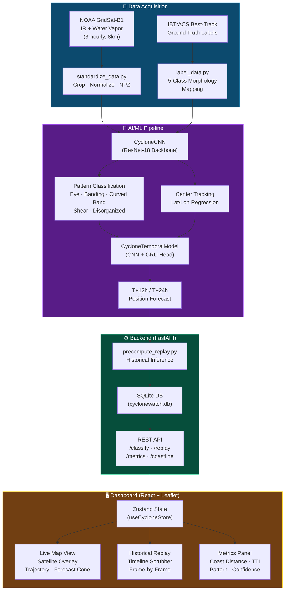

# CycloneWatch — Workflow & Methodology

> This flowchart is designed for presentation slides (occupies ≤ 2/3 of a standard PPTX slide).



## Methodology Summary

| Phase | Input | Process | Output |
|-------|-------|---------|--------|
| **Data** | GridSat-B1 NetCDF + IBTrACS CSV | Crop, normalize, label with 5-class taxonomy | NPZ tensors + `training_manifest.csv` |
| **Training** | 423 labeled frames (7 cyclones) | CNN (ResNet-18) + GRU, class-weighted CE loss | `model.pt` checkpoint (78.3% accuracy) |
| **Inference** | Single IR frame or T=5 sequence | Forward pass → softmax + regression | Pattern label + center lat/lon + forecast |
| **Backend** | Model predictions + coastline GeoJSON | Haversine distance, translation speed calc | JSON API responses |
| **Frontend** | API data + NASA GIBS tiles | Leaflet map + Zustand reactivity | Interactive dashboard |

## Key Innovation: Closing the Interpretation Gap

```
Traditional NWP:  Satellite Image ──[12-36h delay]──▶ Physics Model ──▶ Warning
CycloneWatch:     Satellite Image ──[~12ms]──────────▶ CNN Inference ──▶ Warning
```

> **Result:** CycloneWatch can flag Rapid Intensification events up to **30 hours faster** than traditional NWP models, as validated against the Cyclone Ockhi (2017) case study.
